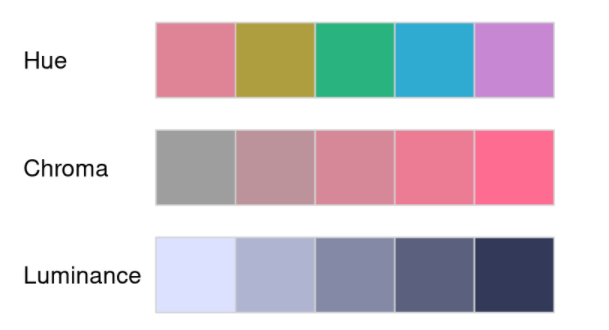

# colorspace包

[参考来源：公众号“R语言和统计”](https://mp.weixin.qq.com/s/gSlgrIQl5oPwz718I9yauA)

介绍一个强大的R包{colorspace}，可用于选择颜色和调色板，修饰和创建自己想要的颜色，以及将颜色恰当地应用到各种作图中。

此R包中色彩空间(color space)的构建是基于一种名为HCL (Hue-Chroma-Luminance)的色彩系统。

其中，H (Hue)指的是颜色类型；C (Chroma)指的是彩度；L (Luminance)指的是颜色的亮度(下文中就用H、C、L分别指代上述单词)。

定义干巴巴的且有点抽象，下图可助于理解： 

## 含有的颜色与调色板

```{r}
library("colorspace")
```

```{r}
## 查看包中已存在的颜色与调色板
hcl_palettes(plot = TRUE)
```
```{r}
## 查看包中已存在的颜色名字
hcl_palettes()
```

colorspace包含三大类调色板： 

A. Qualitative（定性的）： 通常用于含有不同组别的数据，并且组别之间没有等级关系。函数为：`qualitative_hcl()`

B. Sequential（连续的）： 用于等级或数值关系，比如，由低到高的数据。函数为：`sequential_hcl()`

C. Diverging（分散的）： 用于有等级或数值关系，含有一个中间值，分别往两边延伸的数据。函数为：`diverging_hcl()`

## 提取颜色

```{r}
color4 <- qualitative_hcl(4, palette = "Set 2")  # 4个颜色，“Set 2”调色板
color4
```
### plot配色

```{r}
plot(EuStockMarkets, plot.type = "single", col = color4, lwd = 2.5)
legend("topleft", colnames(EuStockMarkets), col = color4, lwd = 2.5, bty = "o") 
```

### barplot配色

```{r}
barplot(10:1, col = sequential_hcl(10, palette = "Blues 3"))
```

从上述代码可知，sequential_hcl()所提取的颜色可以直接传递到R基础作图中的"col"（颜色）中。

### ggplot2配色

应用到{ggplot2}中，使用规则可以归纳成下方代码： 

scale_<aesthetic>_<datatype>_<colorscale>()

<aesthetic>可替换成fill，color和colour。
<datatype>指变量的类型，如discrete，continuous和binned。
<colorscale>指上文提到的调色类型：qualitative, sequential和diverging。

根据作图的目的，选择适当的函数，之后就可以轻易的调配颜色。下面举一个例子：

```{r message=FALSE, warning=FALSE}
library("ggplot2")

ggplot(iris, aes(x = Petal.Length, fill = Species)) +
  geom_density(alpha = 0.6) +
  theme_bw() +
  scale_fill_discrete_qualitative(palette = "Cold")
```

## 将颜色回归HCL

```{r}
specplot(sequential_hcl(7, "YlGnBu"),    # 提取7种颜色
         main = "Sequential: YlGnBu")    # 题目
```

## 不同图配色

- Qualitative（定性的）

```{r}
par(mfrow = c(1, 3))         # 使图片可放置的位置变成1行3列
demoplot(qualitative_hcl(4, "Pastel 1"), type = "pie")
demoplot(qualitative_hcl(4, "Set 2"), type = "scatter")
demoplot(qualitative_hcl(4, "Dark 3"), type = "lines")
```
- Sequential（连续的）

```{r}
par(mfrow = c(1, 3))
demoplot(sequential_hcl(99, "Purple-Blue"), type = "heatmap")
demoplot(sequential_hcl(99, "Reds"), type = "perspective")
demoplot(sequential_hcl(4, "Viridis"), type = "spine")
```

- Diverging（分散的）:
```{r}
par(mfrow = c(1, 3))
demoplot(diverging_hcl(99, "Tropic", power = 2.5), type = "map")
demoplot(diverging_hcl(5, "Green-Orange"), type = "mosaic")
demoplot(diverging_hcl(5, "Blue-Red 2"), type = "bar")
```

```{r}
## 上面的情况都属于白色（透明）背景的，如果变成黑色炫酷的背景呢
par(mfrow = c(2, 3), bg = "black")
demoplot(sequential_hcl(9, "Oslo"), "heatmap")
demoplot(sequential_hcl(9, "Turku"), "heatmap")
demoplot(sequential_hcl(9, "Inferno", rev = TRUE), "heatmap")
demoplot(qualitative_hcl(9, "Set 2"), "lines")
demoplot(diverging_hcl(9, "Berlin"), "scatter")
demoplot(diverging_hcl(9, "Cyan-Magenta", l2 = 20), "lines")
```


